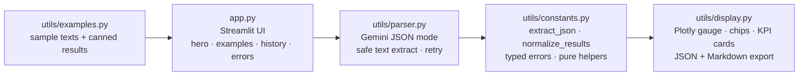

# Signal — AI Market Intelligence Parser

> Paste the noise. Read the signal.

Drop in any messy block of text — a news article, an earnings note, a "quick question" email that is never quick — and Google Gemini hands back a clean, structured intelligence report: a two-sentence executive summary, the entities and numbers that matter, a sentiment read on a gauge, and topic tags. One paste in, one briefing out.

## Why I built it

I read more earnings notes and market emails than is strictly healthy, and I kept doing the same chore by hand: skim three paragraphs, hunt for the one number that mattered, guess the tone, move on. That is pattern-matching a machine should do. So I taught one to do it — and then I spent most of my time making sure it never hands you a stack trace instead of a report. The first version parsed JSON by stripping markdown fences with regex and hoping. This version is built so the UI cannot throw a red error at you, key or no key.

## Tech Stack


## What you get

Every analysis returns one well-typed JSON object, rendered as:

- A **two-sentence executive summary** — the headline, nothing more.
- **Key entities** grouped into companies / people / places, as colored chips.
- **Numbers and metrics** pulled straight from the text, as real KPI cards.
- **Sentiment** (Positive / Neutral / Negative) with a confidence score on a **Plotly gauge**.
- Up to **5 topic tags**.

## Features

- **Gemini JSON mode reliability.** The model is called with `response_mime_type="application/json"` and a low temperature, so a single JSON object is the primary path — no fence-scraping. If output ever drifts, a pure `extract_json()` helper strips fences and runs a string- and escape-aware brace-depth scan to recover the object from stray prose.
- **Crash-proofing.** The parser never blindly touches `response.text`. It walks `response.candidates[].content.parts`, concatenates the text parts, and raises a typed error on safety / recitation / empty finishes instead of a `ValueError` traceback.
- **Friendly error states.** A typed exception hierarchy (`MissingKeyError`, `APICallError`, `EmptyResponseError`, `MalformedJSONError`) maps to specific, on-brand messages. Yank the key, paste an emoji, paste a novel, or hit a flagged input — you still get a calm explanation, never a red traceback.
- **Guaranteed-typed output.** `normalize_results()` fills missing keys, coerces stray strings into lists, clamps the confidence score to 0–100, and forces the sentiment label into a known value, so the renderer can never `KeyError` or `TypeError`.
- **One-click example texts.** Three "Try an example" buttons — an entity-dense news snippet, a metric-dense earnings note, and a deliberately sentiment-ambiguous business email — each run a full analysis with zero typing.
- **Never-dead demo.** Each example ships with pre-baked, normalized results. With no key configured (or if a cloud secret lapses), the example buttons render those canned reports, so a deployed link always shows a populated report.
- **In-session history.** Your last 10 analyses appear as clickable cards in the sidebar with a sentiment color dot and preview. Click one to revisit it — no extra API call — or clear the lot with one button.
- **JSON + Markdown export.** Download the raw JSON, or grab a paste-ready Markdown report (H1, blockquote summary, sentiment line, grouped entity bullets, a metrics table, and `#topic` tags) that drops straight into Notion, Slack, or an email and stays formatted.
- **Input guardrails.** Long pastes are truncated to a 20k character cap, short input is gated, and a live character counter goes amber near the cap and red past it.
- **Resilience.** The model is cached (`st.cache_resource`) so the SDK is not re-initialized on every click, with a single retry on transient API failures and malformed JSON only — never on auth errors.
- **Security.** Every model-supplied string is HTML-escaped before it touches the custom HTML for chips, cards, and the hero.

## Architecture

The app is three thin layers: a Streamlit UI, a Gemini-backed parser, and a renderer — with all the pure logic (parsing, normalization, helpers) in a `constants` module that imports neither Streamlit nor the Gemini SDK, so the tests run offline.



- **`app.py`** — the UI: gradient hero, the example gallery, the live character counter, the clickable history rail, and all the friendly error states.
- **`utils/parser.py`** — `extract_intelligence(text) -> dict`. Reads the key safely, calls Gemini in JSON mode (model cached), retries once on transient failures, and safely extracts text without tripping over safety blocks.
- **`utils/constants.py`** — config, theme tokens, the typed exception hierarchy, and every pure helper. No Streamlit, no Gemini imports.
- **`utils/display.py`** — `render_results(results)`. The Plotly confidence gauge (colored by sentiment), entity chips, hashtag topic tags, KPI metric cards, and the dual export bar.
- **`utils/examples.py`** — sample texts and their pre-baked, normalized results.

The public contract is preserved: `extract_intelligence(text: str) -> dict` and `render_results(results: dict)`.

## How to run it locally

```bash
git clone https://github.com/KiritoH4Z3/signal-ai-parser.git
cd signal-ai-parser
pip install -r requirements.txt

# Add your API key (a free Google AI Studio key works fine)
mkdir -p .streamlit
cp secrets_template.toml .streamlit/secrets.toml
# then edit .streamlit/secrets.toml and set GOOGLE_API_KEY
# grab a free key at https://aistudio.google.com

streamlit run app.py
```

No key handy? Run it anyway — preview mode and the example buttons still serve full reports.

## Tests (no key, no network)

The parsing and normalization logic lives in `utils/constants.py`, which imports no Streamlit and no Gemini SDK. So the 24 unit tests in `tests/test_parser.py` run in well under a second with **no API key and no network** — covering fenced / prose / nested / garbage JSON recovery, confidence scoring, label and metric normalization, missing-key backfill, and the Markdown report builder. They also run in CI on every push (`.github/workflows/tests.yml`).

```bash
pytest tests/ -q          # or: python tests/test_parser.py
```

## Deploy on Streamlit Community Cloud

1. Push this repo to GitHub.
2. Go to [share.streamlit.io](https://share.streamlit.io) and connect `KiritoH4Z3/signal-ai-parser`.
3. Set the main file to `app.py`.
4. In **Advanced settings → Secrets**, add:
   ```toml
   GOOGLE_API_KEY = "your_google_ai_studio_api_key_here"
   ```
5. Click **Deploy**. (Forget the secret and it still boots — the examples serve canned reports in preview mode.)

## Screenshots

> Coming soon — drop your screenshots in here.

```
docs/screenshot-report.png   — a full intelligence report
docs/screenshot-gauge.png    — the sentiment gauge + KPI cards
```

## About the author

Built by **Abdullah Mohammed Hazeq** — I like turning unstructured text into things you can actually act on, and I like it even more when the app refuses to fall over while doing it.

[](https://github.com/KiritoH4Z3)
[](https://linkedin.com/in/abdullahmhazeq)
[](mailto:ahazeq.mena@gmail.com)
