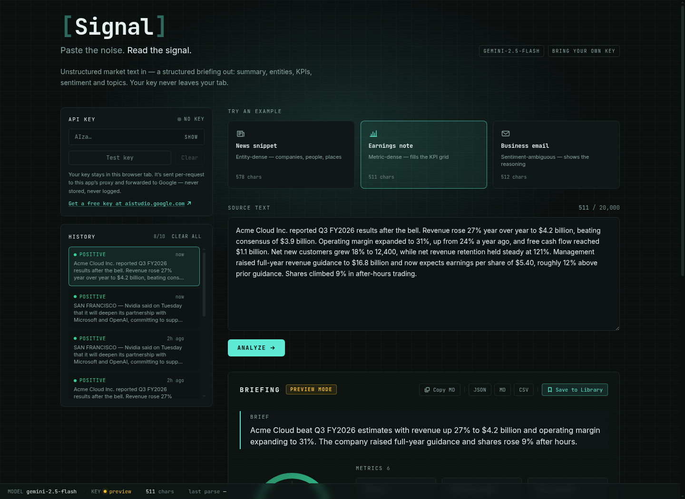
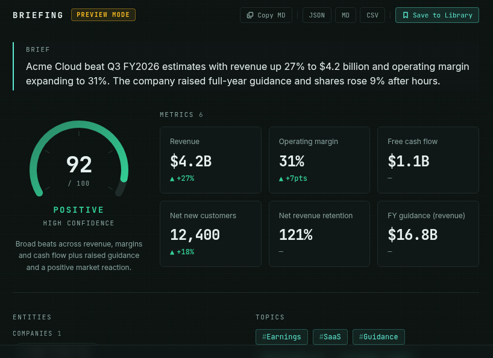
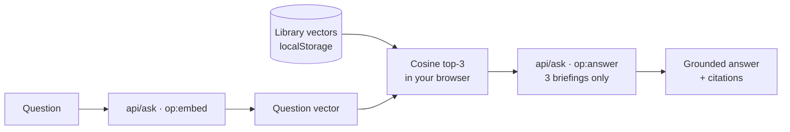

# Signal — AI Market Intelligence Parser

> Paste the noise. Read the signal.

Drop in any messy block of text — a news article, an earnings note, a "quick question" email that is never quick — and Gemini hands back a structured intelligence report: a two-sentence executive summary, the entities and numbers that matter, a sentiment read on a gauge, and topic tags. One paste in, one briefing out.

Then save briefings to a library and **ask questions across all of them**. Retrieval runs in your browser; only the three most relevant briefings are ever sent to the model.




## Why I built it

I read more earnings notes and market emails than is strictly healthy, and I kept doing the same chore by hand: skim three paragraphs, hunt for the one number that mattered, guess the tone, move on. That is pattern-matching a machine should do.

So I taught one to do it — and then spent most of my time on the unglamorous half: making sure it never hands you a stack trace instead of a report. An LLM will cheerfully return prose where you asked for JSON, a `SAFETY` block with no text at all, or a number as a boolean. Every one of those has a named error and a friendly panel here. The model is the easy part. Everything around the model is the work.

## Try it without a key

Click any of the three examples and you get a complete briefing immediately — summary, gauge, KPI cards, the lot. No key, no network call, no signup. Those run from canned results so the thing you are evaluating actually demonstrates itself.

To analyze **your own** text you bring your own Gemini key ([free from Google AI Studio](https://aistudio.google.com)). Paste it into the key panel, hit **Test key**, and the LED turns green.

## The BYOK privacy model

The key panel is the feature I thought hardest about, because "paste your API key into my website" is a big ask.

- **`sessionStorage` only.** The key dies when you close the tab. Never `localStorage`, never a cookie — a cookie would ride along on every request automatically.
- **Header, never URL.** It travels as `X-Gemini-Key` to this app's own API route, which forwards it to Google as `x-goog-api-key`. Query strings land in server logs and browser history; headers don't.
- **Never stored, never logged.** The route holds it in a local variable for the duration of one request. There is no database. There is no logger.
- **Same-origin only**, enforced by CSP: `connect-src 'self'`.

Your briefing history and library live in `localStorage` and never leave your machine either. The asymmetry is deliberate: history should survive a reload, a key should not survive the tab.

## What you get



Every analysis returns one well-typed JSON object, rendered as an executive summary, entity chips grouped by companies / people / places, KPI cards with ▲▼ deltas, a sentiment gauge with a confidence score and the model's stated reasoning, and up to five topic tags. Export any briefing as JSON, Markdown, or CSV — or copy the Markdown straight into a doc.

## The RAG bit

Save briefings to the Library and the **Ask** box answers questions across them:



Two details I care about:

**Retrieval is client-side.** Your saved briefings never leave the browser wholesale. Only the top three — chosen by cosine similarity against vectors already in `localStorage` — are sent as context.

**Citations are verified, not trusted.** The prompt instructs the model to answer only from the supplied briefings and to say plainly when they don't cover the question. But a prompt is an instruction, not an enforcement mechanism, so the route filters returned citation ids against the ids it actually sent. A hallucinated source is dropped before it reaches you.

## Results

| Measure | Number |
|---|---|
| Tests | **171 passing** in ~5s (9 files, all offline — no key, no network) |
| First-load JS | **113 kB** for `/console`, **98 kB** for the landing — both statically prerendered |
| Runtime dependencies | **4** — `next`, `react`, `react-dom`, `server-only` |
| Source | 38 TypeScript files |
| Accessibility | **0 violations** (accesslint), **0 contrast failures** at WCAG AA |
| Error paths | **8 named codes**, each with a friendly panel |

That dependency count is the number I am most pleased with. No AI SDK — the Gemini calls are plain `fetch` against the REST API, which means full header control and trivially mockable tests. No chart library — the gauge is hand-built SVG. No vector database — retrieval is a dot product and a sort over at most 25 items that already live in the tab.

The tests run with zero API credit because every Gemini call is mocked at the `fetch` boundary. The whole parsing pipeline — brace-depth JSON recovery, type coercion, confidence-band mapping — is pure functions, so it is testable without a model.

## Architecture

```
app/
  page.tsx              the landing page — server component
  console/page.tsx      the workbench shell — server component, no client JS
  api/analyze/          POST: the Gemini proxy
  api/validate-key/     POST: cheap key check (the green LED)
  api/ask/              POST: {op: "embed" | "answer"} — the RAG route
components/
  Workbench.tsx         the console's single "use client" island
  landing/              hero extraction diagram + its provenance hairlines
  report/               gauge, KPI cards, chips, exports, skeleton, errors
  library/              BriefingLibrary, AskArchive
lib/
  types.ts errors.ts config.ts    the contracts — written first, everything codes against them
  extract-json.ts normalize.ts    pure pipeline, heavily tested
  gemini.ts prompt.ts             server-only (import "server-only")
  vector.ts storage.ts            cosine + topK; guarded storage
```

**Contracts first.** `types.ts` and `errors.ts` were written before any feature code. Every module — routes, components, tests — codes against those types, which is why the UI cannot receive a shape it doesn't handle.

**One client island.** `console/page.tsx` stays a server component; `Workbench` is the only `"use client"` boundary on it. The landing page holds to the same rule — it ships one island, and only because a hairline that points at a phrase inside flowing text has to measure where that phrase landed.

## Handling the model's bad days

| What Gemini does | What happens |
|---|---|
| Returns prose wrapped around the JSON | Fence-strip, then a string- and escape-aware brace-depth scan recovers the object |
| Returns malformed JSON anyway | One retry with a fresh call, then a friendly `malformed_json` panel |
| Returns a `SAFETY` block with no candidate | `empty_response` — never a crash on `response.text` |
| Says confidence is `"85%"`, or `true`, or nothing | Coerced to a 0–100 score with band backfill and a sane default |
| Rejects the key | `invalid_key` with a link back to AI Studio |
| Rate-limits you | `rate_limited`, said in English |

The parser never blindly touches `response.text`. It walks `candidates[].content.parts`, concatenates the text parts, and raises a typed error when there is nothing to read.

## Run it

Needs Node 18+.

```bash
npm install
npm run dev          # http://localhost:3003
npm test             # 171 tests, no key required
npm run typecheck
```

No `.env` needed — bring the key in the UI. A `GEMINI_API_KEY` env var is supported as a server-side fallback if you'd rather host it with your own key.

Deploying to Vercel: import the repo, and that is genuinely it — no env vars, no database, no build config.

## Accessibility

Not an afterthought, and it changed the design. Deltas use ▲/▼ glyphs *and* colour, never colour alone (WCAG 1.4.1). The gauge carries `role="img"` on the SVG with the score spoken aloud, while the caption speaks the label — together they announce without repeating each other. `text-console-dim/60` composites to 3.28:1 against the console background, so it isn't used anywhere; every token clears AA. Every control is a real `<button>`, focus rings are visible, results are announced via `aria-live`, and animation collapses under `prefers-reduced-motion`.

The key input allows password managers on purpose. Blocking them fails WCAG 3.3.8 — it would force you to hand-transcribe a 39-character key every session, since `sessionStorage` deliberately forgets it.

## Known limits

Honest notes rather than a silent gap:

- **No error tracking.** No Sentry, no analytics, deliberately. There is no server state to observe and no key to leak into a breadcrumb — adding a reporter would mean shipping a third-party script to a page whose whole pitch is that your key stays in the tab. If this grew past a portfolio piece, that's the first thing I'd revisit.
- **Rate limiting is in-memory**, so it resets on cold start and doesn't coordinate across serverless instances. It's a courtesy guard, not a quota system — with BYOK, visitors spend their own Gemini quota, which is the real limit.
- **The live-key path is verified by mocked tests, not by a live key.** Every Gemini call is mocked at the `fetch` boundary, so what's proven is that the code does the right thing given a response shape. Whether `gemini-embedding-001` returns 768-float vectors in request order is Google's contract, not mine, and I've assumed it.
- **The library caps at 25 briefings** and vectors are stored at 768 dimensions rather than the native 3072 — 3072 floats runs ~60 kB per entry against a ~5 MB `localStorage` budget. Cosine normalizes magnitude, so the trim costs less than it sounds.

---

Built by [Abdullah](https://github.com/KiritoH4Z3) in the UAE. The legacy Streamlit version lives in this repo's git history, where it is happy.
